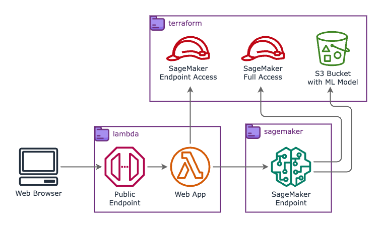
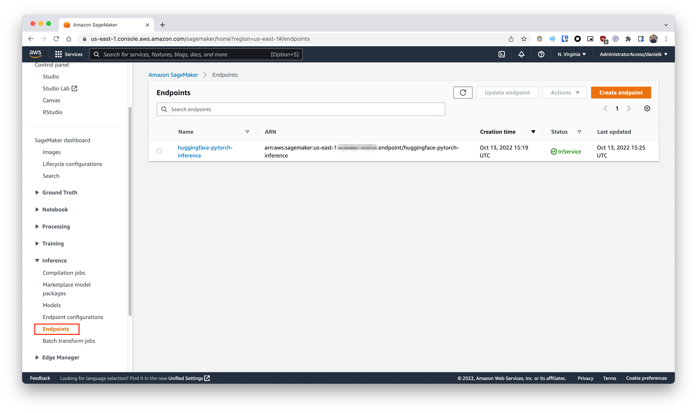
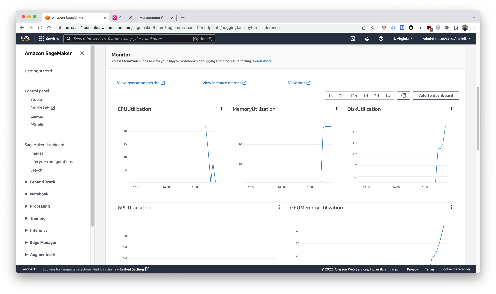
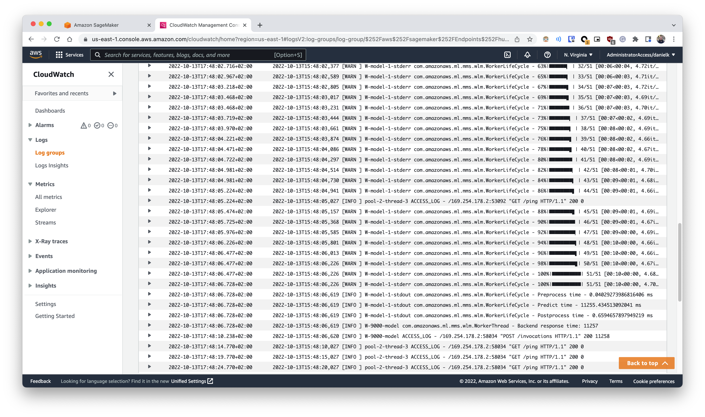
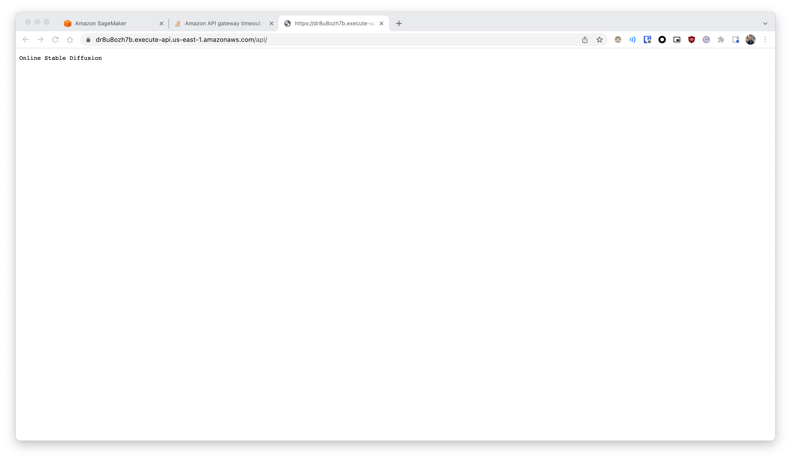
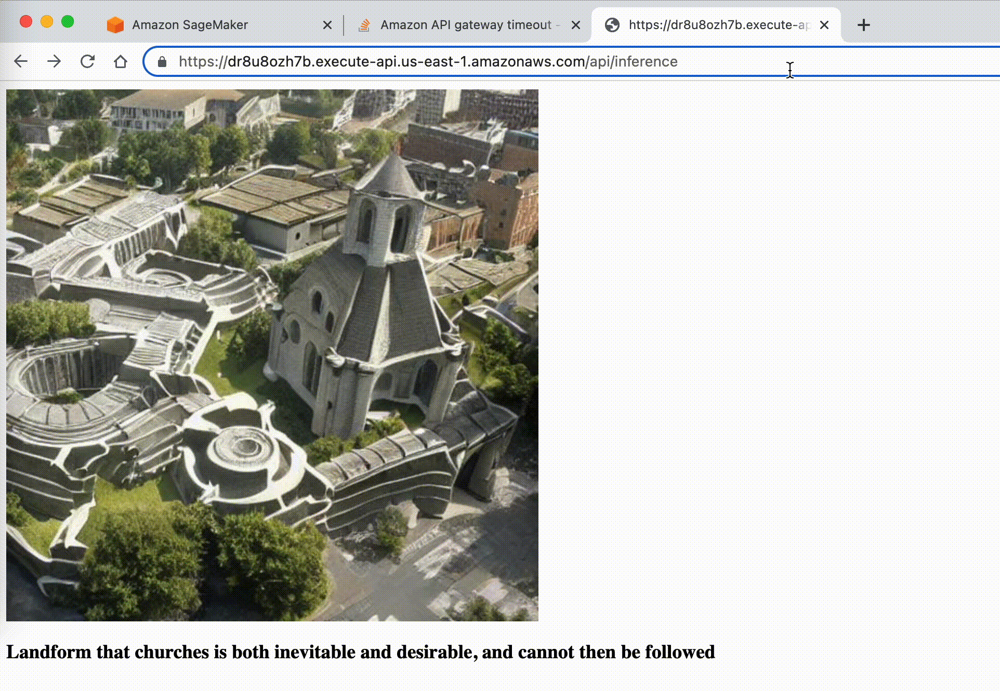
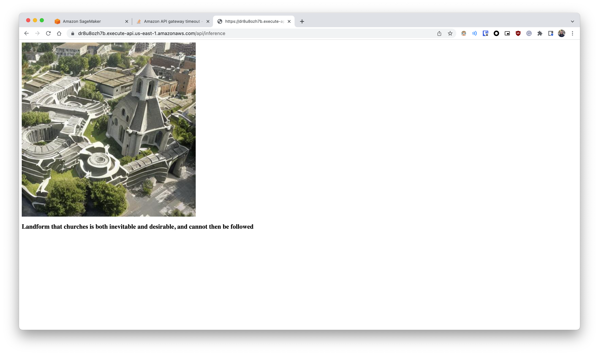

# Your own Stable Diffusion endpoint with AWS SageMaker

[Stable Diffusion](https://stability.ai/blog/stable-diffusion-public-release) is the name of a Deep Learning model created by stability.ai that allows you to generate images from their description. In short, you feed a textual scene description to the model and it returns an image that fits that description. What is cool about it is that it can generate very artistic and arguable beautiful images resembling pieces of art like the following


In this repo you will find everything needed in order to spin-up your own personal public endpoint with a Stable Diffusion model deployed using AWS SageMaker to show your friends 😎

- [Your own Stable Diffusion endpoint with AWS SageMaker](#your-own-stable-diffusion-endpoint-with-aws-sagemaker)
  - [TL;DR](#tldr)
  - [Setting things up](#setting-things-up)
  - [Trying the model locally](#trying-the-model-locally)
  - [Going to the cloud](#going-to-the-cloud)
    - [Initial setup](#initial-setup)
    - [Deploy on AWS using SageMaker](#deploy-on-aws-using-sagemaker)
    - [Lambda + API Gateway](#lambda--api-gateway)
  - [Clean-up](#clean-up)
  - [Conclusion](#conclusion)

## TL;DR

Assuming you already have `asdf` and `pyenv` installed:

- Define the bucket name (where the model will be sent) in `./terraform/variables.tf`
- Run:

```bash
# Here you will need to provide your huggingface credentials in order to confirm
# the model license has been accepted
INSTALL_TOOLING=true bash setup.sh

cd terraform/ && terraform init && terraform apply && cd ../
cd sagemaker/ && pip install -r requirements && bash zip-model.sh && python sagemaker-create-endpoint.py cd ../
cd lambda/sd-public-endpoint/ && pip install -r requirements.txt && bash deploy.sh && cd ../../
```

The endpoint that will appear in the output can be used for the inferences. And here's how to use it

- `<endpoint>/`              -> Generates a random description and feeds it into the model
- `<endpoint>/default`       -> Uses the default description "a photo of an astronaut riding a horse on mars"
- `<endpoint>/<description>` -> Uses the `<description>` as input for the model. You can use spaces here.

## Setting things up

For this repo, you will need these tools:

| Tool | Version |
| ---- | ------- |
| `awscli` | 2.8.2 |
| `terraform` | 1.3.2 |
| `python` | 3.9.13 |

For python, it's recommended to use [`pyenv`](https://github.com/pyenv/pyenv-installer), which allows you to install several versions of python at the same time with simple commands like this: `pyenv install 3.9.13`

For the rest, you can use a tool called [`asdf`](https://asdf-vm.com/guide/getting-started.html), which allows basically the same but for several other tools. If you have it installed, you can install the rest with just `asdf install`.

To be able to clone the repo with the ML model (`stable-diffusion-v1-4/`), we will also need [`git-lfs`](https://git-lfs.github.com/) (that allows versioning of large files). The model is defined as a submodule of this repo and after attempting to clone the submodule, you will be requested to provide your huggingface account credentials in order to clone it. This it to confirm that you have accepted the license required to have access to the model weights.

And finally, [`pigz`](https://zlib.net/pigz/) is also necessary as it allows parallel gzip compression. This makes the model packaging for SageMaker run much faster.

So, to do all of this, the `setup.sh` script can be used for that. It can be used on Mac OS X or Debian-based linux distros. If you already have `asdf` and `pyenv` installed and want to install the rest, just run

```sh
INSTALL_TOOLING=true bash setup.sh
```

However, if you already have the tooling, and just want `git-lfs` and `pigz` with the submodule cloned, please run:

```sh
bash setup.sh
```

## Trying the model locally

To better understand how to use the model and the inference code we'll use later on, we first should try to run the model locally. Based on the [official release page](https://stability.ai/blog/stable-diffusion-public-release) you should be able to access the model weights on their [huggingface page](https://huggingface.co/CompVis/stable-diffusion-v1-4). Here we will use version `v1.4`.

> 📄 In order to have access to the weights, you have to accept their terms of use

On the page we can see code samples showing how we should be able to run an inference on the model. There you will see examples on how to make a standard inference, however it's recommended to have a NVIDIA GPU with at least 10GB of VRAM. To allow my weaker hardware to make an inference, I choose to test the configuration using `float16` precision instead, which is the code that you can find at `local/code.py`

> ℹ️ There is also a `local/code-mac.py` available for those that want to try it out on a mac. However, bare in mind that one inference can take several minutes (~30 min on a M1 Pro), whereas in a GPU it might take 5 seconds using the low VRAM configuration on a RTX 3070

For my local computer, I used [`nvidia-docker`](https://github.com/NVIDIA/nvidia-docker) to allow myself to run the code inside a container. This way I don't have to worry about installing the right version of CUDA (relative to pytorch) on my machine.

So, going to the fun part, to make an inference, you just need to run `cd local && bash build-run.sh`.

> All script in this repo assume that they are being executed from their own directories

The whole execution can take several minutes on the first time in order to build the container image with the model inside. And after everything has finished, you should be able to see image generated at `local/output/output.png`.

You might see something like this on the default description of `"a photo of an astronaut riding a horse on mars. VFX, octane renderer"`:


And you can change the description by changing the content of the `prompt` variable in `local/code.py`

## Going to the cloud

Cool, so now that we have the inference code working, is time to put this in the cloud to, ultimately, make it available to others. Let's start by talking about the resource we'll need and the overall architecture.

Firstly, about how the ML model will be executed, although we could simply spin-up an EC2 instance and attach a web-server to it to receive the images as requests, we will use [AWS SageMaker](https://aws.amazon.com/pt/sagemaker/), which allows us to do exactly that and much more in a managed way (it means that several components, e.g. the web-server implementation, will be managed by AWS). SageMaker will manage the EC2 instance with a GPU and will give us a [***private***](https://docs.aws.amazon.com/sagemaker/latest/dg/realtime-endpoints-deployment.html) endpoint to interact with the model. Since we are using huggingface, both have a nice integration and you can learn more about it from the [huggingface docs about SageMaker](https://huggingface.co/docs/sagemaker/inference) or the [AWS docs about huggingface](https://docs.aws.amazon.com/sagemaker/latest/dg/hugging-face.html) 🤝.

However, one thing to notice is that SageMaker will provide a private endpoint only accessible if you have access to the AWS account associated with the resource. Since we want a public endpoint, we need to put on top of it a [lambda](https://aws.amazon.com/lambda/?nc1=h_ls) that will forward requests from an [API Gateway](https://aws.amazon.com/api-gateway/). This combination follows the recommended approach from an official [AWS blog post](https://aws.amazon.com/blogs/machine-learning/call-an-amazon-sagemaker-model-endpoint-using-amazon-api-gateway-and-aws-lambda/).

> ⚠️ One import limitation of API Gateway to notice is the hard limit of [30 seconds timeout](https://docs.aws.amazon.com/apigateway/latest/developerguide/limits.html#http-api-quotas) on the request. Because of this, the same low VRAM configuration (`float16` precision) was needed in order to guarantee a lower response time.

Putting it all together, the architecture goes like this:



Showing all resources needed and from which directory each resource is managed. Here is a brief description:

| Directory | Description |
| --------- | ----------- |
| `lambda`  | Has the lambda + API Gateway implementation using a framework called [chalice](https://aws.github.io/chalice/#)|
| `sagemaker` | Contains the python code to manage the SageMaker Model, Endpoint, and the custom inference code. It also has the script used to pack and send the model to an S3 bucket |
| `terraform` | Manages the S3 bucket itself and the IAM roles required by the lambda code (to access the SageMaker endpoint) and for the Sagemaker endpoint (to access the model on the S3 bucket) |

### Initial setup

Before anything, we need to deploy the roles and the S3 bucket mentioned in order to set the stage to the rest of the resources. You can configure the bucket name used in the file `terraform/variables.tf`. After that, you can run (assuming that you already have the access to your AWS account properly configured):

```bash
cd terraform
terraform init
terraform apply
```

In total 11 resources should be created. In this process, a couple of `.txt` will be created. Those files will be used by other parts of this repo to get the value of AWS ARNs and the bucket name used

A brief explanation of the roles is as follows:

| Role | Name on IAM | Description |
| ---- | ----------- | ----------- |
| SageMaker Endpoint Access | `lambda-sagemaker-access` | This role basically allows the lambda to execute properly (with the `AWSLambdaBasicExecutionRole` managed policy) and also allows it to invoke a SageMaker endpoint |
| SageMaker Full Access | `sagemaker-admin` | This one has the `AmazonSageMakerFullAccess` managed policy attached to it, which allows, [among other things](https://docs.aws.amazon.com/sagemaker/latest/dg/sagemaker-roles.html#sagemaker-roles-create-execution-role), for the SageMaker endpoint to access the S3 bucket to load the model, and also to publish it own logs |

### Deploy on AWS using SageMaker

With the IAM roles and the S3 bucket in place, now it the time to create the SageMaker endpoint itself. For that, we use the python [package from AWS](https://github.com/aws/sagemaker-huggingface-inference-toolkit) which allow us to use Transformers models with the huggingface SDK.

However, since we will use diffusion type of model, and not transformers, the default inference code will need to be overwritten to use the [`diffusers`](https://github.com/huggingface/diffusers) package (also from huggingface), just like we do in the `local/code.py`

In order to overwrite it, the [package readme](https://github.com/aws/sagemaker-huggingface-inference-toolkit#-user-defined-codemodules) has some general information about it, and also there is an example in [this jupyter notebook](https://github.com/huggingface/notebooks/blob/main/sagemaker/17_custom_inference_script/sagemaker-notebook.ipynb). We are doing what is necessary via the files inside `sagemaker/code`, which has the inference code following SageMaker requirements, and a `requirements.txt`, that has the necessary dependencies that will be installed when the endpoint gets created

With the inference code ready, it's time to ship the model with the code to the created S3 bucket (as the SageMaker endpoint will access the model via this bucket). For this, run:

```bash
cd sagemaker/
bash zip-model.sh
```

> Keep in mind that this process will send around 4.2GB of data to S3. Just remember that cost you are willing to pay 😉

With that, we should have the what we need in the bucket. Now, let's create the SageMaker endpoint. To manage the endpoint, as stated before, we use the [SageMaker toolkit for huggingface](https://github.com/aws/sagemaker-huggingface-inference-toolkit). As such, we have three python scripts that serve as functions to create, use and delete the endpoint.

So let's go ahead and create the endpoint with

```bash
pip install -r requirements  # To install the sagemaker pkg
python sagemaker-create-endpoint.py
```

After this the endpoint will be created, and also a file `endpoint-name.txt` so that the other python scripts can keep its reference. When the endpoint is ready, you will be able to see it in the AWS console like the following image:



Now we should be ready to run an inference. To do it, execute:

```bash
bash sagemaker-use-endpoint.py
```

And we should get a cool image like this one in `sagemaker/output/image.jpg`:


And it's nice that we just this amount of code, now we have a deployment of a ML model server with metrics, logs, health checks, etc. available, as we can see in the following images.

| Metrics | Logs |
| ------- | ---- |
|  |  |

> Yes, to get that cool image from Darth Vader, lots of attempts were required 😅

So far so good, we have a python script capable of make inference on a the Stable Diffusion model, but this python script interacts directly to your AWS resources. To achieve public access, it's time to work on the Lambda + API Gateway

### Lambda + API Gateway

For this part we had couple of options to choose from, like [serverless](https://www.serverless.com/framework/docs/providers/aws/events/http-api) and [Zappa](https://github.com/Miserlou/Zappa?ref=thechiefio), both being serverless frameworks that would allow us to deploy a serverless app (fulfilling the lambda + API Gateway combo).

However, for this project we will go with [chalice](https://aws.github.io/chalice/index.html), which is a serverless framework for python designed from AWS itself that resembles the API design of [Flask](https://flask.palletsprojects.com/en/2.2.x/). Since I never heard about it before I'll give it a try.

The code for the serverless app it's all inside `lambda/`. To manage the `chalice` app, do

```bash
cd lambda
pip install -r requirements.txt
cd sd-public-endpoint
```

This way, you will have the chalice tool installed and will be able to deploy the app with

```bash
pip install -r requirements.txt
bash deploy.sh
```

The script will get the proper IAM role and deploy the app.

> ℹ️ You need to install the dependencies of the serverless app because the dependencies are packaged locally and sent with the app code when publishing the lambda

> ⚠️ Just a reminder about that API Gateway has a non-configurable 30 seconds timeout that might impact your inferences depending on the configuration of the Model. However it seems there is a [workaround for API Gateway](https://stackoverflow.com/a/71778537/4097211)

And now you should have a public endpoint to access the Model, you should be able to use the app like this:

| Page | Description | Image |
| ---- | ----------- | ----- |
| `/api/` | The home page, just for testing |  |
| `/api/inference/<text>` | You can type any text replacing `<text>` and that will become the input for the model, Go wild 🦄 (and you can use spaces) |  |
| `/api/inference/` | And that were the fun actually begins!! If you leave the `<text>` empty, a [random sentence generator](https://pypi.org/project/essential-generators/) will be used to automatically generate the input for the Model. Let programs "talk" to each other and you will be able to use the sentence used below the image |  |

## Clean-up

To clean up everything (and avoid unwanted AWS costs 💸), you can do:

```bash
# Delete the serverless app
cd lambda/sd-public-endpoint/
chalice delete

# Delete the SageMaker resources
cd ../../sagemaker
python sagemaker-delete-endpoint.py
bash delete-model.sh

cd ../terraform/
terraform destroy
```

Now you will only need to delete the related CloudWatch Log groups via the console. Those will be `/aws/lambda/sd-public-endpoint-dev` and `/aws/sagemaker/Endpoints/huggingface-pytorch-inference`

## Conclusion

So here create our own personal cloud deployment of the [popular](https://www.businessinsider.com/stable-diffusion-stability-ai-1b-funding-round-midjourney-dalle-openai-2022-10?international=true&r=US&IR=T) Stable Diffusion ML model and played a little with several cloud resources in the process.

The architecture works fine with play around, but an [asynchronous implementation](https://docs.aws.amazon.com/sagemaker/latest/dg/async-inference.html) might become necessary to allow inferences that take more than 30 seconds, and also for batch processing.
